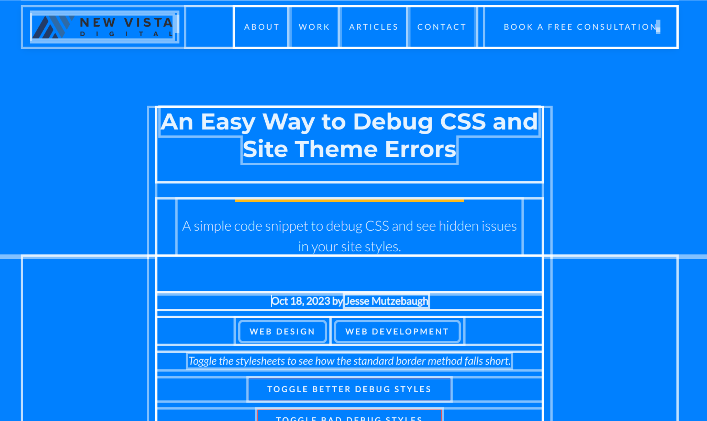
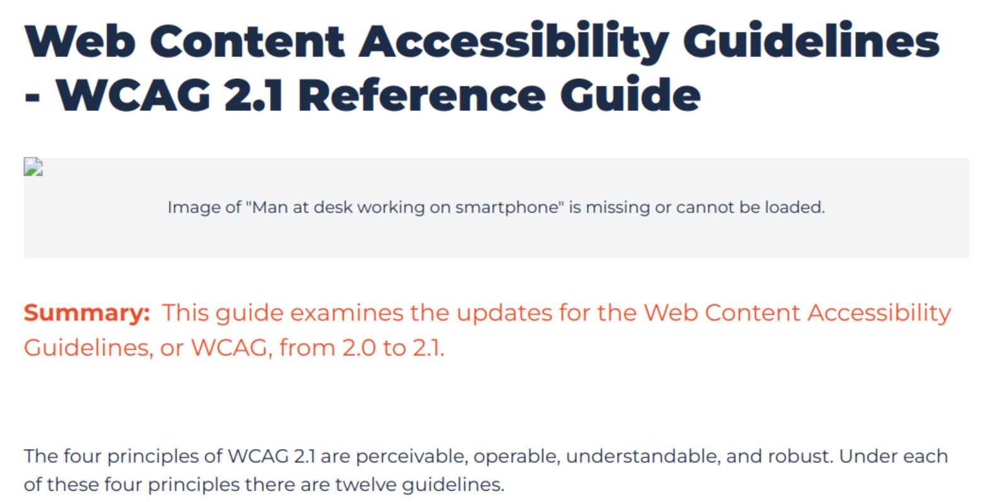

# Fun snippets and resources

## CSS Helpers
### Debugger
This is WAY better than the standard `border: 1px solid red;`` method. The border adds size, which could shift items in your layout. Better to use outline so layout isn't altered.

### Insecure links
Any link with `target="_blank"` should have a `rel="nofollow noreferrer` for performance and security. This will highlight any external link that doesn't have these.

### Image Missing
This is a progressive enhancement for when images are missing. It grabs the `alt` text and provides an explanation of what's going on.

